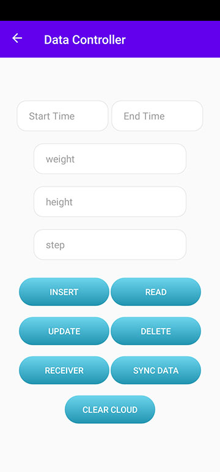

HUAWEI Health Kit Demo
=====

HUAWEI Health Kit (Health Kit for short) allows ecosystem apps to access fitness and health data of users based on their HUAWEI ID and authorization.
The Kit allows your app to access the Health Kit open platform to obtain users' fitness and health data, in order to provide them with ultimate service experience like health care and workout guidance.

#What you can try out
---------------------

    

Requirements
------------

 - [Android SDK](http://developer.android.com/sdk/index.html).
 - Android [7.0 (API 24) ](http://developer.android.com/tools/revisions/platforms.html#7.0).
 - Android SDK Tools
 - Android SDK Build tools 29.0.3
 - Android Support Repository
 - Android Support libraries
 - HMS AG Connect Library
 - HMS Health Kit Library

Reference
------------

 - [Huawei Health Kit](https://developer.huawei.com/consumer/en/doc/development/HMSCore-Guides/service-introduction-0000001050071661)
 
 Preparations
 ------------
 
  - Registering as a Developer to [HUAWEI Developer](https://developer.huawei.com/consumer/en)
  - Import this project with Android Studio and change package name
  - Create an app by referring to [Creating a Project](https://developer.huawei.com/consumer/en/doc/development/AppGallery-connect-Guides/agc-get-started#createproject) and [Creating an App in the Project](https://developer.huawei.com/consumer/en/doc/development/AppGallery-connect-Guides/agc-get-started#createapp)
  - Set the data storage location
  - Enabling Required Services : Health Kit
  - Generating a Signing Certificate Fingerprint
  - Configuring the Signing Certificate Fingerprint
  - Get your agconnect-services.json file to the app root directory

Building
--------

To build, install and run a debug version, run this from the root of the project:

    ./gradlew app:assembleDebug
